[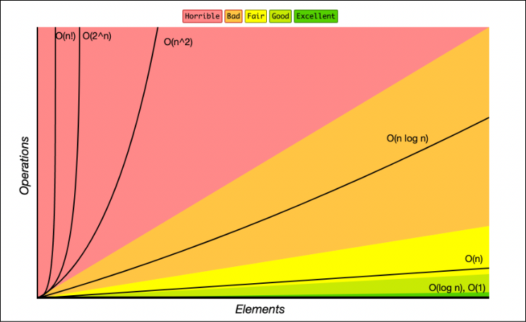](https://www.bigocheatsheet.com/)
[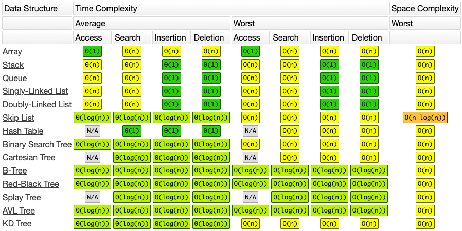](https://www.bigocheatsheet.com/)


## Data Structure Selection Map
Use this guide to choose a data structure based on the access patterns and core operations your application requires. 

| If Your Primary Goal Is To...     | Use This Data Structure      | Time Complexity (Average) | Key Trade-off / Constraint                  |
| :-------------------------------- | :--------------------------- | :------------------------ | :------------------------------------------ |
| Access items rapidly by index     | Array / Vector               | O(1) Read                 | Slow O(n) insertions/deletions in the middle.|
| Insert/Delete frequently at ends  | Linked List                  | O(1) Inserts/Deletes      | Slow O(n) sequential search to find elements.|
| Enforce Last-In, First-Out (LIFO) | Stack                        | O(1) Push / Pop           | No random access to middle elements.        |
| Enforce First-In, First-Out (FIFO) | Queue                        | O(1) Enqueue / Dequeue    | No random access to middle elements.        |
| Look up values instantly by key   | Hash Table / HashMap         | O(1) Search / Insert      | Elements are completely unordered.          |
| Keep keys sorted with fast lookup | Balanced BST / TreeMap       | O(log n) Search / Insert  | Slightly slower lookups than Hash Maps.     |
| Constantly pull min or max values | Binary Heap / Priority Queue | O(1) Peek, O(log n) Extract| Poor O(n) time to search for arbitrary items.|
| Look up strings by prefixes       | Trie                         | O(L) where L is length    | Higher memory usage compared to hashing.    |
| Model networks or connections     | Graph                        | Varies by algorithm       | High complexity to store and traverse.      |
| Query range sums dynamically      | Segment Tree / Fenwick       | O(log n) Queries & Updates| Complex to implement and maintain.          |

------------------------------

## Algorithm Design Paradigm Map
When designing a custom solution, evaluate your problem traits against these core algorithmic strategies. [6, 7] 

* Divide and Conquer
    - When to use: Your problem can be split into independent, identical sub-problems.
    - Examples: [MergeSort](https://www.geeksforgeeks.org/merge-sort/), [QuickSort](https://www.geeksforgeeks.org/quick-sort/), and Binary Search.
* Dynamic Programming (DP)
    - When to use: Your problem breaks into overlapping sub-problems with an optimal substructure.
    - Examples: [Knapsack Problem](https://www.geeksforgeeks.org/0-1-knapsack-problem-dp-10/), Longest Common Subsequence, and Fibonacci. 
* Greedy Approach
    - When to use: Making the locally optimal choice at each step yields a globally optimal solution.
    - Examples: Huffman Encoding, Dijkstra's Shortest Path, and Prim's MST. 
* Backtracking
    - When to use: You must explore all possible permutations, combinations, or paths, dropping paths as soon as they fail.
    - Examples: N-Queens, String Permutations, and Sudoku Solvers.


## Tree

### primary binary tree traversal orders

| Traversal Type | Strategy | Order of Visits                | Common Use Case                                    |
| :------------- | :------- | :------------------------------ | :------------------------------------------------- |
| **Preorder**   | DFS      | Root → Left → Right            | Copying or serializing a tree                      |
| **Inorder**    | DFS      | Left → Root → Right            | Getting sorted data from a Binary Search Tree (BST) |
| **Postorder**  | DFS      | Left → Right → Root            | Deleting a tree or parsing math expressions        |
| **Level Order**| BFS      | Level by level (Left to Right) | Finding the shortest path or level-by-level printing|


## Graphs

### DFS

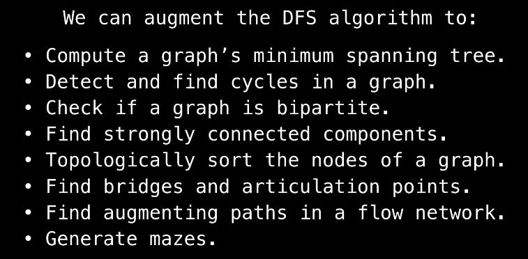


### Pathfiding

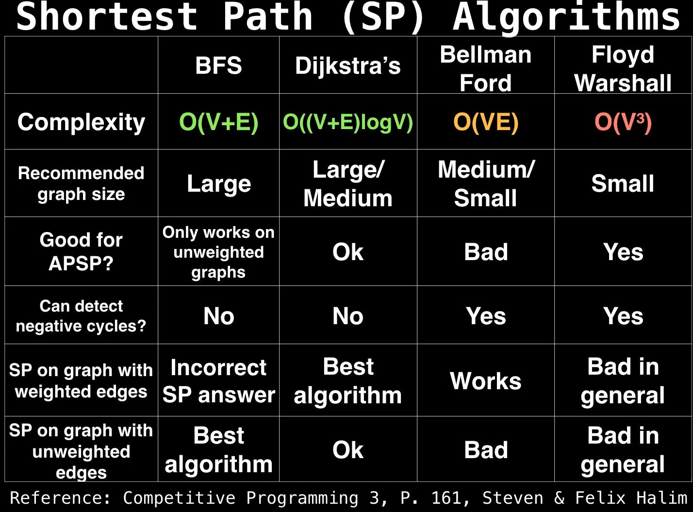

##### BFS with Bitmasking

In standard BFS scenarios, a visited array or set is diligently maintained to steer clear of revisiting nodes. However, BFS with Bitmasking challenges this norm. Nodes, instead of being dismissed, are revisited, now equipped with an additional layer of information — the state. This state, often represented by a bitmask, augments the node’s identity, enriching the exploration process. Used in solution of Travelling salesman problem.

[TSP solution with BFS + Bitmasking video explanation pt1](https://www.youtube.com/watch?v=cY4HiiFHO1o)

[TSP solution with BFS + Bitmasking video explanation pt2, code](https://www.youtube.com/watch?v=udEe7Cv3DqU)

## Graph Pathfinding Algorithms: Selection Guide


Graph pathfinding algorithms find the most efficient route between nodes in a network and are classified into four main categories:

### 1. Uninformed Search Algorithms (Blind Search)
Explore a graph systematically without external knowledge or distance estimates.

* **Breadth-First Search (BFS)**: Explores nodes layer by layer. Guarantees the shortest path in unweighted graphs.
* **Depth-First Search (DFS)**: Explores as deep as possible before backtracking. Does not guarantee an optimal path.
* **Iterative Deepening DFS (IDDFS)**: Combines DFS's space efficiency with BFS's path optimality by gradually increasing depth limits.
* **Uniform Cost Search (UCS)**: Traverses the graph by expanding the lowest cumulative cost node. Variant of Dijkstra’s algorithm.
* **Bidirectional Search**: Runs two simultaneous searches (forward from start, backward from goal) meeting in the middle.

### 2. Informed Search Algorithms (Heuristic-Driven)
Use heuristics (educated guesses about remaining distance) to guide the search, significantly cutting down calculation time.

* **A* Search**: Combines actual distance from start with a heuristic estimate to the goal. Highly efficient and optimal.
* **Greedy Best-First Search**: Focuses solely on the heuristic estimate to the destination. Fast but prone to suboptimal paths.
* **Iterative Deepening A* (IDA*)**: Optimizes memory usage by using an incrementally increasing cutoff cost threshold.
* **D* (Dynamic A*)**: Incremental search algorithm that recalculates paths in real-time as environments change.
* **Fringe Search**: Variation of A* using a fringe list to find the shortest path faster by reducing node sorting overhead.
* **Lifelong Planning A* (LPA*)**: Incremental heuristic search designed for dynamic graphs where edge costs change over time.

### 3. Single-Source Shortest Path (SSSP)
Calculate the shortest paths from one specific source node to all other reachable nodes in a weighted graph.

* **Dijkstra's Algorithm**: Solves SSSP on graphs with non-negative edge weights using a priority queue.
* **Bellman-Ford Algorithm**: Computes SSSP and handles negative edge weights. Detects negative weight cycles.
* **DAG Shortest Path**: Utilizes topological sorting to find shortest paths in Directed Acyclic Graphs in linear time.
* **Dial's Algorithm**: Optimized version of Dijkstra's algorithm tailored specifically for small integer edge weights.
* **Delta-stepping**: Parallel algorithm that divides Dijkstra's workload into steps for massive networks.

### 4. All-Pairs Shortest Path (APSP)
Calculate the absolute shortest routes between every single pair of nodes across the entire network.

* **Floyd-Warshall Algorithm**: Dynamic programming approach updating a distance matrix for dense graphs.
* **Johnson's Algorithm**: Combines Bellman-Ford and Dijkstra's algorithms to efficiently handle sparse graphs with negative weights.
* **Seidel's Algorithm**: Utilizes fast matrix multiplication to solve the APSP problem efficiently on unweighted graphs.

---

## Pathfinding Selection Matrix

| Algorithm | Graph Type | Edge Weights | Best For | Key Advantage / When to Use |
| :--- | :--- | :--- | :--- | :--- |
| **BFS** | Unweighted | None | Single-Source | Shortest path on unweighted or uniform-cost networks |
| **DFS** | Unweighted | None | Connectivity | Checking if a path exists or exploring full mazes |
| **IDDFS** | Unweighted | None | Single-Source | Finding shortest paths when memory is extremely limited |
| **Bidirectional** | Unweighted / Weighted | Non-negative | Single-Pair | Cutting search space in half when start and goal are known |
| **Dijkstra** | Weighted | Non-negative | Single-Source | Finding the absolute shortest path from one point to all others |
| **Bellman-Ford** | Weighted | Negative allowed | Single-Source | Graphs containing negative weights or needing cycle detection |
| **DAG Shortest Path**| Directed Acyclic | Any weight | Single-Source | Maximum speed on directional graphs with no cycles |
| **A*** | Weighted | Non-negative | Single-Pair | Standard game AI and GPS routing with geometric coordinates |
| **Greedy Best-First**| Weighted | Non-negative | Single-Pair | Getting a fast answer where accuracy is not critical |
| **IDA*** | Weighted | Non-negative | Single-Pair | Finding optimal heuristic paths on memory-constrained systems |
| **D*** | Dynamic / Changing | Non-negative | Single-Pair | Robotics and autonomous vehicles navigating unknown terrain |
| **LPA*** | Dynamic / Changing | Non-negative | Single-Pair | Path replanning when edge costs change frequently over time |
| **Floyd-Warshall** | Dense / Weighted | Negative allowed | All-Pairs | Small, dense networks where you need distances between all nodes |
| **Johnson's** | Sparse / Weighted | Negative allowed | All-Pairs | Large, sparse networks where you need distances between all nodes |

---

### Deep Dive: When to Use Each

#### Uninformed Search (Unweighted Graphs)
* **Breadth-First Search (BFS)**: Use when every step costs exactly the same (e.g., social networks finding 1st/2nd-degree connections, or peer-to-peer networks).
* **Depth-First Search (DFS)**: Use when you need to visit every node anyway (topological sorting), or when solving puzzles where you must backtrack from dead ends.
* **Iterative Deepening (IDDFS)**: Use in game trees (like chess) where you want the completeness of BFS but cannot afford its massive memory footprint.
* **Bidirectional Search**: Use in massive social networks or maps when you know both the starting point and the exact destination point.

#### Single-Source Shortest Path (Weighted Graphs)
* **Dijkstra’s Algorithm**: Use for stable networks with varying positive costs (e.g., network routing protocols like OSPF, or transit routing).
* **Bellman-Ford Algorithm**: Use when your graph has negative values (like financial arbitrage networks or transactional balances) and you must detect illegal infinitely repeating loops.
* **DAG Shortest Path**: Use for scheduling problems, project management (PERT/CPM), or asset valuation where dependencies only move forward in time.

#### Informed Search (Heuristic-Driven)
* **A* Search**: Use when you need the shortest path to a single target and can calculate a straight-line distance estimate (e.g., video game character movement, Google Maps).
* **Greedy Best-First Search**: Use when you need immediate results and a "close enough" path is acceptable (e.g., quick path estimation in real-time strategy games).
* **D* / LPA***: Use when a robot or vehicle maps a territory in real-time, allowing it to fix its route dynamically without recalculating the entire map from scratch.

#### All-Pairs Shortest Path (Entire Network Matrices)
* **Floyd-Warshall**: Use when you have a small network (under a few hundred nodes) and need to build a permanent look-up routing table.
* **Johnson’s Algorithm**: Use for the exact same purpose as Floyd-Warshall, but when your network is sparse (mostly disconnected nodes) to save significant memory and processing time.


### Eulerian circuit and path

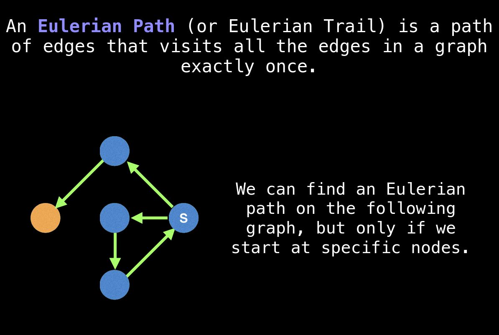

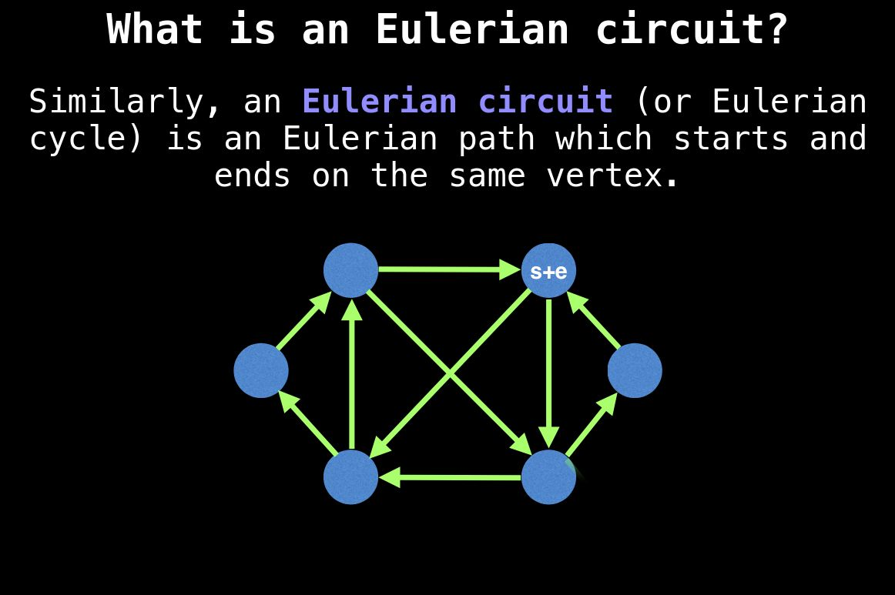


### Topological sort

A topological sort is a linear ordering of vertices in a directed acyclic graph (DAG) such that for every directed edge u → v, vertex u comes before v. It is widely used for task scheduling, package dependency resolution, and course prerequisites

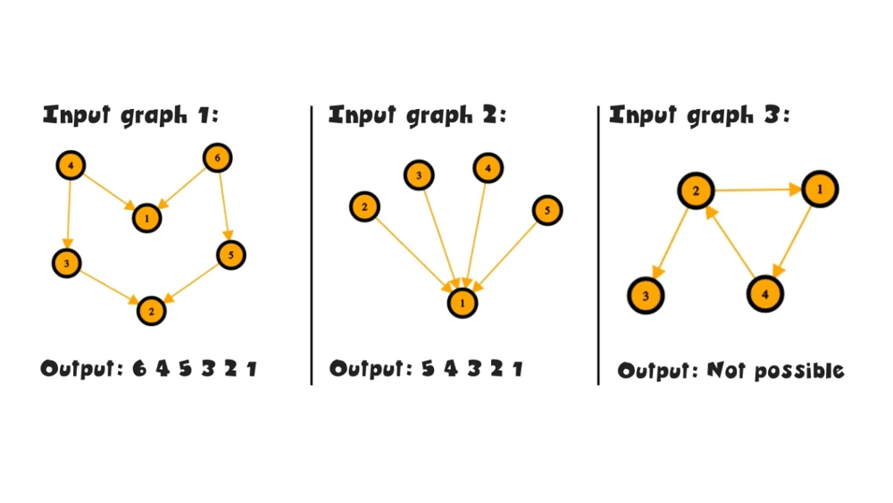
<!-- 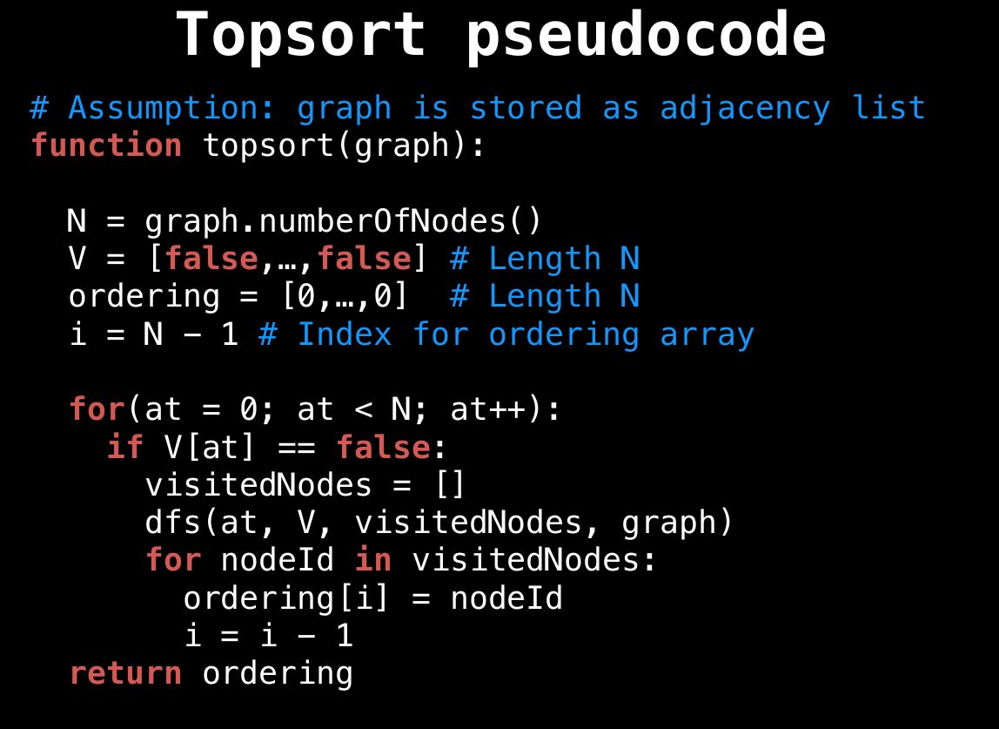 -->
<!-- 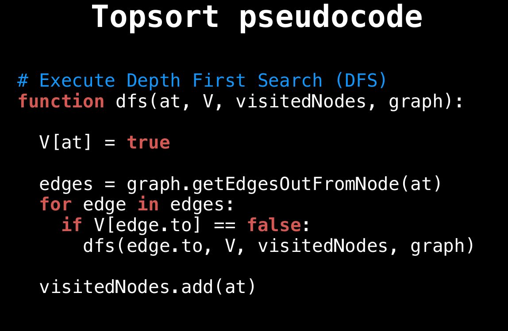 -->

algorithms which can be used in topological sort:

* **Kahn's Algorithm**: A breadth-first approach that repeatedly removes nodes with an in-degree of zero to build the sorted list.
* **Depth-First Search (DFS) Method**: A recursive approach that visits nodes deeply and adds them to the result list upon backtracking.
* **Parallel Topological Sort**: A variation of Kahn's algorithm that groups independent tasks into concurrent levels for scheduling.
* **Tarjan's Algorithm**: A cycle-detecting approach that groups strongly connected components and sorts them in a reverse topological order.


https://leetcode.com/discuss/post/4252467/topological-sorting-on-graph-by-sanjeev1-m0ly/


### Union Find

Union-Find, also known as the Disjoint-Set Union (DSU) data structure, is a highly efficient tool used to keep track of a partition of elements into mutually exclusive (disjoint) sets. It is widely used to solve graph connectivity problems, group elements together, and detect cycles in undirected graphs

is used when you need to track, merge, and query partitions of a dataset into non-overlapping groups in near-constant time. It is primarily applied in graph theory and network analysis to solve dynamic connectivity problems.

**When to Choose Union-Find Over Other Algorithms**:

- Dynamic Graph Modification: Choose it when edges are continuously being added over time, and you need to query connectivity at any moment.
- Efficiency Over BFS/DFS: While Breadth-First Search (BFS) or Depth-First Search (DFS) can find connected components, they take \(O(V + E)\) time and require a full graph traversal every time a new edge is added.
- Near-Constant Operations: With optimizations like path compression and union by rank, Union-Find handles updates and queries in amortized \(O(\alpha(n))\) time, which is effectively constant time (\(O(1)\)).

**Real-World Scenarios**: 

- Social Networks: Tracks friendship circles to instantly check if User A and User B are connected through a chain of mutual friends.
- Network Routing: Models physical connections in telecommunications to determine if a path exists between two nodes or servers.
- Image Segmentation: Clusters adjacent pixels with similar colors or intensities together to isolate objects in computer vision.
- Percolation Theory: Simulates chemistry and physics models to see if liquid can flow through a porous material or grid

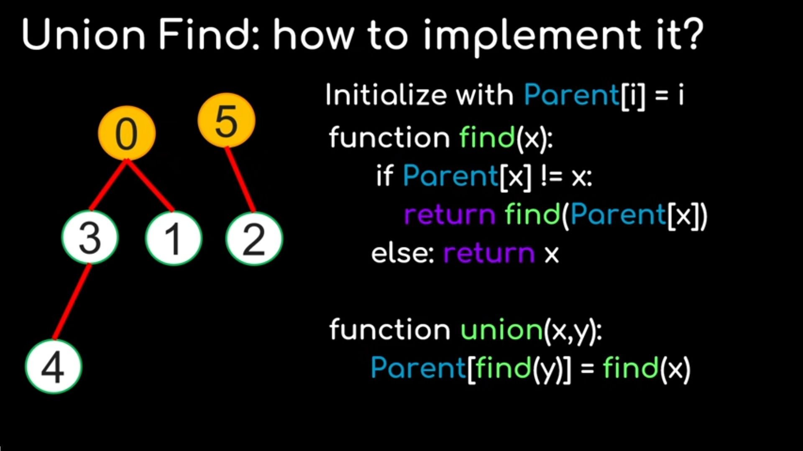

[Union Find in 5 minutes](https://www.youtube.com/watch?v=ayW5B2W9hfo)

#### Union Find is used in:

| Algorithm | Time Complexity | Space Complexity | Best Used When | Practical Example |
| :--- | :--- | :--- | :--- | :--- |
| **Kruskal's MST** | O(E log E) | O(V + E) | Graph is sparse and edges are pre-sorted or easily sortable. | Laying fiber-optic cable to connect cities using the lowest total cable length. |
| **Cycle Detection (Undirected Graph)** | O(E · α(V)) | O(V) | Graph edges arrive dynamically or online, and quick cycle checks are needed. | Checking if adding a new flight path creates a redundant circular loop in a route network. |
| **Percolation Simulation** | O(N² · α(N²)) | O(N²) | Modeling fluid flow, conductivity, or threshold dynamics across grid structures. | Simulating oil flowing through porous rock layers to find continuous extraction paths. |
| **Connected Components (Grid/Graph)** | O(V + E · α(V)) | O(V) | Identifying distinct clusters in unstructured networks or pixel grids. | Finding friend clusters in a social network or segmenting distinct objects in an image. |
| **Maze Generation (Kruskal Variant)** | O(E log E) | O(V + E) | Generating uniform spanning tree mazes with no loops and guaranteed solvability. | Procedural level generation in video games to create distinct room-and-corridor maps. |
| **Tarjan's Offline LCA** | O(V + Q · α(V)) | O(V + Q) | Batched Least Common Ancestor queries on trees are available upfront. | Finding the lowest common manager for multiple pairs of employees in a large org chart. |
| **Compiler Type Unification** | O(N · α(N)) | O(N) | Inferring or checking types across equivalence classes in programming languages. | Resolving type aliases (e.g., `type UserID = Int`) to ensure variable compatibility. |

---
*Note: α refers to the Inverse Ackermann Function, which runs in effective near-constant time O(1) for all practical input sizes.*


### Network flow

Network flow algorithms main categories:

 - **Maximum Flow Algorithms**: These algorithms compute the maximum amount of flow that can pass from a source node $s$ to a sink node $t$ in a directed graph without exceeding edge capacities.

 - **Minimum-Cost Flow Algorithms**: Min-Cost Flow algorithms find a flow that satisfies supply/demand requirements while minimizing the total cost of edge traversal

 - **Specialized & Related Flow Problems**

 - **Global Minimum Cut Algorithms**: These algorithms compute the global minimum cut of an undirected graph (the smallest total edge weight to disconnect any pair of nodes) without requiring a specific $s-t$ pair.

 - **Generalized Flow Algorithms (Flows with Losses / Gains)**: In generalized networks, edges have a gain factor $\gamma(e)$. If flow $f$ enters an edge, $\gamma(e) \cdot f$ leaves it (e.g., modeling financial interest, pipeline leakage, or currency exchange rates).

 - **Dynamic & Dynamic Flow Over Time**: Standard flow models are static. Dynamic flows include time delays on edges, where flow travels along edge $e$ with travel time $\tau(e)$.

 - **Planar & Structured Graph Flow Algorithms**: General max flow takes $O(V^2 E)$ or similar bounds, but specialized algorithms exploit geometric structure

 ---


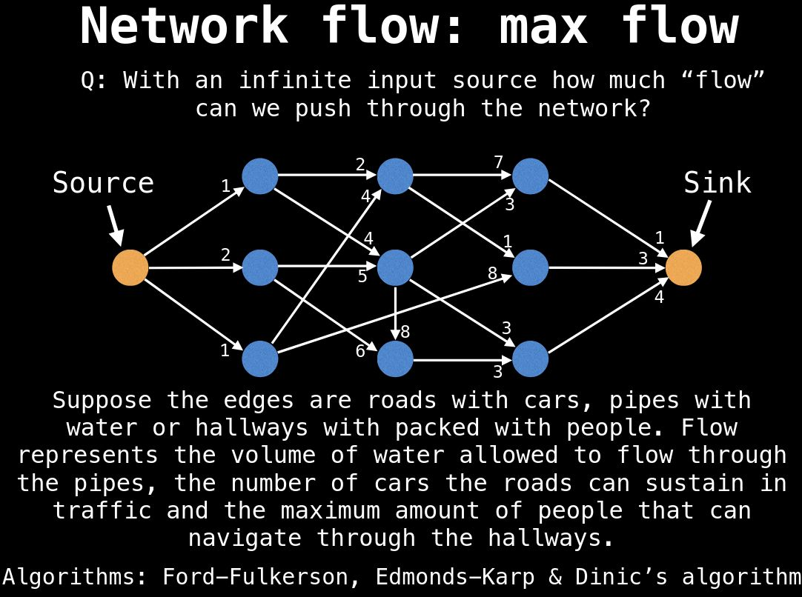

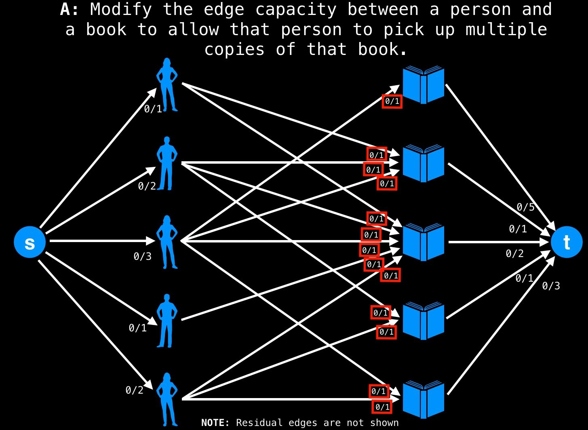

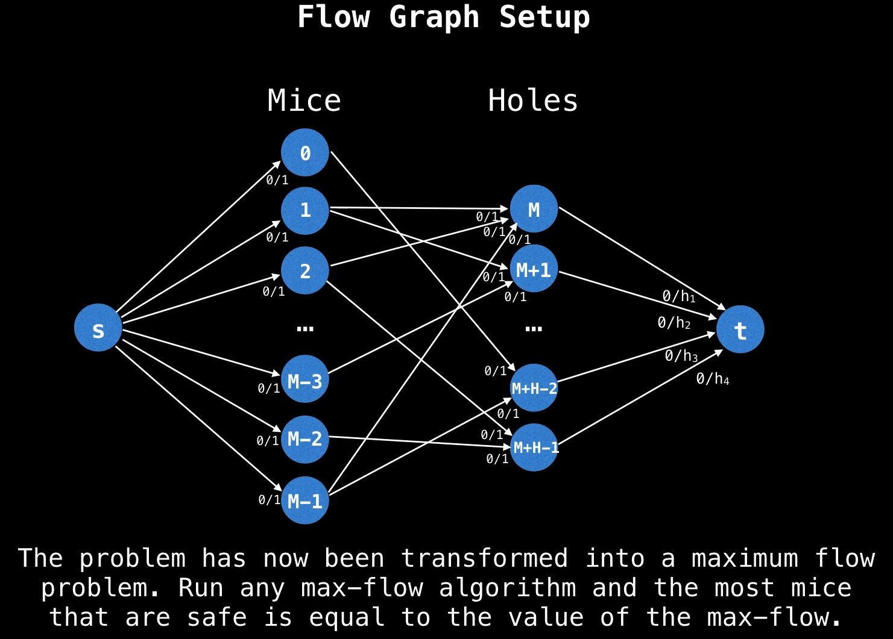

See also: bipartite matching, capacity scaling


#### Max-Flow algorithm selection Guide
The choice of Maximum Flow algorithm depends primarily on **graph density** (the ratio of edges $E$ to vertices $V$), whether capacity values are **integers or floating-point**, and **practical runtime needs** versus theoretical bounds.

---

#### Algorithm Comparison Table

| Algorithm | Time Complexity (Theoretical) | Best Suited For | Real-World Performance | Key Implementation Traits |
| :--- | :--- | :--- | :--- | :--- |
| **Ford-Fulkerson** | `O(E * |f*|)` | Very small networks, integer capacities with known small upper bound. | Can perform poorly or non-converge on irrational capacities if DFS chooses poor augmenting paths. | Simple to write; uses Depth-First Search (DFS) to find augmenting paths. |
| **Edmonds-Karp** | $O(V \cdot E^2)$ | Small-to-medium networks, sparse graphs ($E \ll V^2$). | Predictable and stable; fast enough for typical competitive programming/small graph tasks. | Uses Breadth-First Search (BFS) to find the shortest augmenting path (in terms of edge count). |
| **Dinic's Algorithm** | $O(V^2 E)$ *($O(E \sqrt{V})$ on unit Networks)* | General-purpose default, bipartite matching, unit networks. | Extremely fast in practice; usually outstrips its worst-case theoretical bound. | Builds a **level graph** via BFS and routes multiple blocking flows using DFS in phases. |
| **Push-Relabel** *(FIFO / Highest Label)* | $O(V^3)$ or $O(V^2 \sqrt{E})$ | Dense graphs ($E \approx V^2$), massive flow networks. | Outstanding empirical speed; handles heavy network topologies well. | Operates locally using preflow, excess flow, and height functions instead of global path searches. |
| **Boykov-Kolmogorov (BK)** | Heuristic *(Worst-case exponential)* | Image segmentation, 2D/3D grid graphs, computer vision tasks. | **Fastest in practice** for grid-like spatial structures; slower on random/dense graphs. | Maintains two search trees (source and sink) that grow until they meet. |

---

#### Selection Decision Tree

```
Is your graph a 2D/3D Grid (e.g., Computer Vision / Image Segmentation)?
 ├── YES ──► Boykov-Kolmogorov (BK Algorithm)
 └── NO
      │
      ├── Is the graph very dense (E ≈ V²)?
      │    └── YES ──► Push-Relabel (Highest Label)
      │
      └── Default Choice / Sparse Graph / Bipartite Matching
           └── YES ──► Dinic's Algorithm
```

---

#### Quick Recommendation Summary

1. **Go with Dinic’s Algorithm by default.** It hits the sweet spot between code complexity and practical efficiency. For unit-capacity networks (like Bipartite Matching), Dinic runs in $O(E \sqrt{V})$ time, outperforming most alternatives.
2. **Use Push-Relabel for dense networks.** When edge counts approach $V^2$, push-relabel techniques avoid traversing long path structures and typically terminate much faster.
3. **Use Boykov-Kolmogorov for image/spatial grids.** In computer vision and grid-based graph cuts, BK tree-reuse heuristics drastically reduce search time.


#### Real-World Applications

Max-Flow algorithms are applied widely across engineering disciplines, leveraging either flow routing or min-cut partitioning:

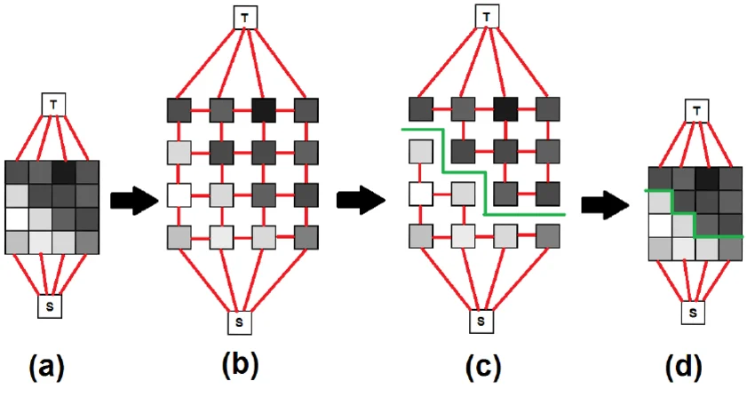

##### 1. Computer Vision & Image Processing
* **Interactive Foreground/Background Segmentation (Graph Cut):** Each pixel is a vertex connected to neighboring pixels and to source/sink terminals representing foreground/background seeds. Min-cut finds the optimal boundary minimizing color/intensity disparity.
* **Stereo Depth Reconstruction:** Finding pixel correspondences between left and right camera images by formulating disparity selection as a multi-label graph cut problem.

##### 2. Transportation & Logistics
* **Pipeline Capacity Analysis:** Finding the maximum rate crude oil can flow from production fields through a complex pipeline network to refineries with varying pipe diameters.
* **Airline & Rail Crew Scheduling:** Modeling duty periods and flight legs as flow networks to assign crews while respecting rest times and geographic constraints.
* **Traffic Management**: Determining the maximum vehicle capacity of a highway system during an emergency evacuation.

##### 3. Telecommunications & Cloud Computing
* **Data Packet Routing**: Maximizing total bandwidth throughput from data centers to end users across internet backbone links.
* **Network Fault Tolerance & Vulnerability Analysis:** inding the minimum set of router failures (edges) that would completely disconnect a branch network from the main server cluster (Min-Cut).

##### 4. Matching & Resource Allocation
* **Maximum Bipartite Matching:** Assigning $N$ workers to $M$ tasks where workers only have specific skills. Connecting a source to all workers, workers to valid tasks, and tasks to a sink (all with capacity 1) allows Max-Flow to find the maximum possible number of assignments.
* **Sports League Elimination:** Determining if a team is mathematically eliminated from winning a league title using Max-Flow network models on remaining head-to-head fixtures.

---

#### When NOT to Use Standard Max-Flow

1. **Cost per unit flow matters:** if pushing flow through a pipe incurs a financial or latency cost, use Min-Cost Max-Flow (MCMF) instead.
2. **Flow decays or expands**: If material vanishes (e.g., electricity loss over long wires) or expands along a path, standard Max-Flow fails. You need Generalized Flow models.
3. **There are multiple independent sources and sinks**: Unless they share the exact same commodity, this requires solving a Multi-Commodity Flow Problem (which is NP-hard and typically solved via Linear Programming).
4. **Dynamic edge costs / real-time updates:** Consider dynamic graph algorithms or continuous flow optimization techniques.


---

[source](https://www.udemy.com/share/101ubu3@22ylwZTQ6HOB4dMz4Zhfhz4Fk5-oDK8-AQUda9PoipxUSg40tWnaiPk_gcJ8wZvW/)

[youtube](https://www.youtube.com/watch?v=LdOnanfc5TM&list=PLDV1Zeh2NRsDj3NzHbbFIC58etjZhiGcG)

[youtube](https://www.youtube.com/watch?v=Tl90tNtKvxs)


## Bitwise Operations

https://gist.github.com/isidzukuri/9898896758369cc273e4b2a8ee5ca3d8

## [Bitmasking](https://www.geeksforgeeks.org/what-is-bitmasking/)

In computer programming, the process of modifying and utilizing binary representations of numbers or any other data is known as bitmasking.

See also chapter 10 "Bit manipulation", "Competitive programmer's handbook" by Antti Laaksonen


## Notes

### Spanning Tree 

spanning tree is a subset of a connected graph that includes every vertex of the original graph using the fewest possible edges without forming any loops or cycles.

### Dijkstra’s algorithm

Dijkstra’s algorithm using a Binary Min-Heap (Priority Queue) is dramatically faster than using a Standard Queue (BFS) because of how they decide which node to process next.

A binary heap guarantees that once a node is popped, its shortest distance is finalized (settled). It processes nodes in order of increasing distance. A standard queue processes nodes in order of discovery, forcing it to backtrack and re-evaluate path costs constantly whenever edge weights vary.

| Approach | Finding Min Distance Node | Edge Relaxation / Decrease-Key | Overall Time Complexity |
| :--- | :--- | :--- | :--- |
| **Dijkstra + Binary Heap** | $O(\log V)$ | $O(\log V)$ | **$O((V + E) \log V)$** |
| **Dijkstra + Unsorted Array** | $O(V)$ | $O(1)$ | $O(V^2)$ |
| **Dijkstra + Standard Queue** | $O(1)$ (FIFO order, *not* min) | $O(1)$ | **$O(2^V)$ worst-case** *(or $O(V \cdot E)$ with SPFA)* |

Also other Advanced Heaps & Priority Queues exists: 


#### 1. Advanced Heaps & Priority Queues

| Data Structure | Extract-Min | Decrease-Key | Overall Complexity | Pros & Cons |
| :--- | :--- | :--- | :--- | :--- |
| **Fibonacci Heap** | $O(\log V)$ | **$O(1)$** (amortized) | **$O(E + V \log V)$** | **Best theoretical bound** for dense graphs ($E \approx V^2$). In practice, constant factors and memory overhead make it slower than Binary Heap for most practical inputs. |
| **$d$-ary Heap** (e.g., $d=4$) | $O(d \log_d V)$ | $O(\log_d V)$ | $O(E \log_{d} V)$ | **Faster in practice than Binary Heap** on modern CPUs due to better cache locality (nodes have more children packed closely in memory). |
| **Pairing Heap** | $O(\log V)$ (amortized) | $O(1)$ (amortized) | $O(E + V \log V)$ | A simpler, practical alternative to Fibonacci Heaps that performs extremely well in benchmarks. |
| **Radix Heap** | $O(1)$ (amortized) | $O(1)$ (amortized) | $O(E + V \log C)$ | Specialized for integer edge weights (bounded by $C$). Very fast for small, non-negative integer weights. |

---

#### 2. Specialized Non-Heap Data Structures

##### A. Dial's Algorithm (Bucket Queue)
If all edge weights are **small integers** bounded by a maximum weight $W$:
* **Structure:** An array of buckets indexed $0$ through $W \cdot V$, where each bucket holds a list of nodes with that exact current distance.
* **Complexity:** **$O(V \cdot W + E)$**
* **When to use:** When $W$ is small (e.g., unit weights $W=1$ degrades to standard BFS in $O(V + E)$).

##### B. 0-1 BFS (Double-Ended Queue / `VecDeque`)
If edge weights can **only be 0 or 1**:
* **Structure:** A standard Deque (`std::collections::VecDeque` in Rust).
* **Logic:** If an edge has weight `0`, push the target node to the **front** of the deque. If `1`, push to the **back**.
* **Complexity:** **$O(V + E)$** (Strictly linear time, beating $O((V+E)\log V)$).

---

#### Summary Recommendation

* **For general LeetCode / competitive programming:** Use the built-in **Binary Heap** (`std::collections::BinaryHeap` in Rust).
* **For 0-1 edge weights:** Use a **`VecDeque`** (0-1 BFS).
* **For production high-performance graph engines:** Use a **4-ary Heap** or **Radix Heap**.


## Useful links

[Comprehensive collection of knowledge: videos, pdfs, implementations](https://github.com/williamfiset/Algorithms)

[Datastructure cheat sheet short](https://www.interviewcake.com/data-structures-reference)

[Datastructure cheat sheet with explenations](https://zerotomastery.io/cheatsheets/data-structures-and-algorithms-cheat-sheet/)

[Data structures, Algorithms mindmap](https://coggle.it/diagram/W5E5tqYlrXvFJPsq/t/master-the-interview-click-here-for-course-link/c25f98c73a03f5b1107cd0e2f4bce29c9d78e31655e55cb0b785d56f0036c9d1)

[Graph data structure and algorithms](https://www.geeksforgeeks.org/dsa/graph-data-structure-and-algorithms/)

[Big-o cheat sheet](https://www.bigocheatsheet.com/)

[Visualising data structures and algorithms through animation](https://visualgo.net/en)

https://www.cs.usfca.edu/~galles/visualization/AVLtree.html

https://www.cs.usfca.edu/~galles/visualization/RedBlack.html

https://en.wikipedia.org/wiki/List_of_algorithms


## Books

Competitive Programmer’s Handbook. Antti Laaksonen

The Algorithm Design Manual. Steven S. Skiena


## Video

[Floyd–Warshall algorithm in 4 minutes ](https://www.youtube.com/watch?v=4OQeCuLYj-4)
